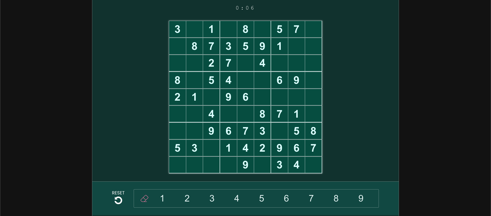

# Vuedoku: Build a Sudoku app with Vue

<a href="" target="_blank">Part I: Game Logic</a> |
<a href="" target="_blank">Part II: Game UI</a> |
<a href="" target="_blank">Part III: Game UX</a>

 

Welcome to **Vuedoku**, a three part story where we build a Sudoku app using Vue3 and configure the logic required to make the puzzle playable.

## About

I have always loved solving (or attempting) sudoku puzzles. The patterns and logic that are implemented in a simple numbers game makes a very satisfying, repeatable challenge.

I thought it would be fun to try to build a very simple Sudoku app, and document some lessons along the way.

<h3>Built Using:</h3>

## Getting Started

`npm i` - to install all dependencies

`npm run dev` - to begin development at [localhost:3000](http://localhost:3000)!

`npm run test:unit` - to run and watch spec files with Vitest.

## Contributing

## Contact
